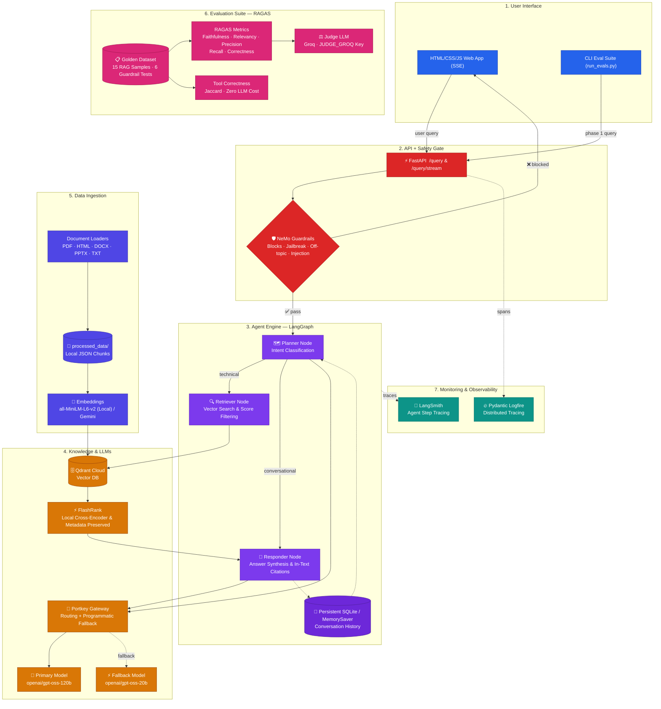
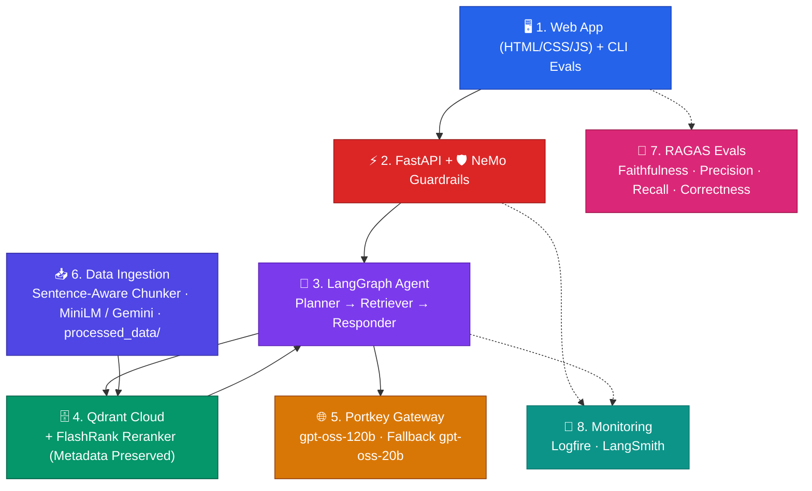

# Enterprise Agentic RAG: LangGraph · Guardrails · LLM Gateway · RAGAS Evals

```mermaid
graph LR

    %% ── Interfaces ───────────────────────────────────────────────────────────
    subgraph UI ["🖥️  Interface Layer"]
        direction TB
        CHAT["Bespoke Web UI\nHTML/CSS/JS + SSE"]
        CLI_EVAL["CLI Eval Suite\nrun_evals.py"]
    end

    %% ── API + Safety ─────────────────────────────────────────────────────────
    subgraph SAFETY ["🛡️  API + Safety"]
        direction TB
        API["⚡ FastAPI\n/query + /query/stream"]
        GR{"NeMo\nGuardrails"}
    end

    %% ── LangGraph Agent ──────────────────────────────────────────────────────
    subgraph AGENT ["🧠  LangGraph Agentic Core"]
        direction TB
        PL["🗺️ Planner\nIntent Classification"]
        RT["🔍 Retriever\nVector Search & Typed Outcomes"]
        CG{"⚖️ Context Grader\nEvidence Assessment"}
        QR["🔄 Query Rewriter\nBounded Refinement (Max 1)"]
        RS["💬 Responder\nAnswer Generation"]
        CV{"🔍 Citation Validator\nReference Grounding [N]"}
        MEM[("💾 SQLite / MemorySaver\nConversation History")]
    end

    %% ── Retrieval ────────────────────────────────────────────────────────────
    subgraph RETRIEVAL ["🔎  Retrieval Layer"]
        direction TB
        QD[("🗄️ Qdrant Cloud\nVector DB")]
        FR["⚡ FlashRank\nLocal Cross-Encoder & Metadata Preserved"]
    end

    %% ── LLM Gateway ──────────────────────────────────────────────────────────
    subgraph GATEWAY ["🌐  LLM Gateway"]
        direction TB
        PK["🔀 Portkey\nUnified Gateway"]
        G1["🧠 Primary Model\nopenai/gpt-oss-120b"]
        G2["⚡ Fallback Model\nopenai/gpt-oss-20b"]
    end

    %% ── Ingestion ────────────────────────────────────────────────────────────
    subgraph INGEST ["📥  Ingestion Pipeline"]
        direction TB
        LOADER["Document Loaders\nPDF · HTML · DOCX · PPTX · TXT"]
        PARSED[("📁 processed_data/\nLocal JSON Chunks")]
        EMB["🔢 Embeddings\nall-MiniLM-L6-v2 (Local) / Gemini"]
    end

    %% ── Observability ────────────────────────────────────────────────────────
    subgraph OBS ["📡  Observability"]
        direction LR
        LF["🔥 Pydantic\nLogfire"]
        LS["🦜 LangSmith\nTracing"]
    end

    %% ── Evals ────────────────────────────────────────────────────────────────
    subgraph EVALS ["🧪  RAGAS Evaluation Suite"]
        direction LR
        GD[("📋 Golden Dataset\n15 Samples · 6 Guardrail Tests")]
        RAGAS["RAGAS Metrics\nFaithfulness · Relevancy\nPrecision · Recall · Correctness"]
        TC["Tool Correctness\nJaccard · Zero LLM"]
        JUDGE["⚖️ Judge LLM\nGroq · JUDGE_GROQ Key"]
    end

    %% ── Main Query Flow ──────────────────────────────────────────────────────
    CHAT -->|query| API
    API --> GR
    GR -->|"❌ blocked"| CHAT
    GR -->|"✅ pass"| PL
    PL -->|conversational| RS
    PL -->|technical| RT
    RT --> QD
    QD --> FR
    FR --> RS
    RS --> PK
    PL --> PK
    PK --> G1
    PK -.->|fallback| G2
    RS -.-> MEM
    MEM -.-> PL

    %% ── Ingestion Flow ───────────────────────────────────────────────────────
    LOADER --> PARSED
    PARSED --> EMB
    EMB --> QD

    %% ── Eval Flow ────────────────────────────────────────────────────────────
    CLI_EVAL -->|phase 1| API
    GD --> RAGAS
    GD --> TC
    RAGAS --> JUDGE

    %% ── Observability Traces ─────────────────────────────────────────────────
    API -.->|spans| LF
    AGENT -.->|traces| LS

    %% ── Colors ───────────────────────────────────────────────────────────────
    classDef ui        fill:#3B82F6,stroke:#1D4ED8,color:#fff,rx:8
    classDef safety    fill:#EF4444,stroke:#B91C1C,color:#fff,rx:8
    classDef agent     fill:#8B5CF6,stroke:#6D28D9,color:#fff,rx:8
    classDef retrieval fill:#10B981,stroke:#047857,color:#fff,rx:8
    classDef gateway   fill:#F59E0B,stroke:#B45309,color:#fff,rx:8
    classDef ingest    fill:#6366F1,stroke:#4338CA,color:#fff,rx:8
    classDef obs       fill:#14B8A6,stroke:#0F766E,color:#fff,rx:8
    classDef evals     fill:#EC4899,stroke:#BE185D,color:#fff,rx:8
    classDef memory    fill:#7C3AED,stroke:#5B21B6,color:#fff,rx:8

    class CHAT,CLI_EVAL ui
    class API,GR safety
    class PL,RT,RS agent
    class QD,FR retrieval
    class PK,G1,G2 gateway
    class LOADER,PARSED,EMB ingest
    class LF,LS obs
    class GD,RAGAS,TC,JUDGE evals
    class MEM memory
```

---

## System Architecture — Portal View

```mermaid
graph TB

    subgraph UI ["1. User Interface"]
        direction LR
        CHAT["HTML/CSS/JS Web App (SSE)"]
        CLI_EVAL["CLI Eval Suite (run_evals.py)"]
    end

    subgraph SAFETY ["2. API + Safety Gate"]
        direction LR
        API["⚡ FastAPI  /query & /query/stream"]
        GR{"🛡️ NeMo Guardrails\nBlocks · Jailbreak · Off-topic · Injection"}
    end

    subgraph AGENT ["3. Agent Engine  —  LangGraph"]
        direction LR
        PL["🗺️ Planner Node\nIntent Classification"]
        RT["🔍 Retriever Node\nVector Search & Score Filtering"]
        RS["💬 Responder Node\nAnswer Synthesis & In-Text Citations"]
        MEM[("💾 Persistent SQLite / MemorySaver\nConversation History")]
    end

    subgraph KNOWLEDGE ["4. Knowledge & LLMs"]
        direction LR
        QD[("🗄️ Qdrant Cloud\nVector DB")]
        FR["⚡ FlashRank\nLocal Cross-Encoder & Metadata Preserved"]
        PK["🔀 Portkey Gateway\nRouting + Programmatic Fallback"]
        G1["🧠 Primary Model\nopenai/gpt-oss-120b"]
        G2["⚡ Fallback Model\nopenai/gpt-oss-20b"]
    end

    subgraph INGEST ["5. Data Ingestion"]
        direction LR
        LOAD["Document Loaders\nPDF · HTML · DOCX · PPTX · TXT"]
        PROC[("📁 processed_data/\nLocal JSON Chunks")]
        EMB["🔢 Embeddings\nall-MiniLM-L6-v2 (Local) / Gemini"]
    end

    subgraph EVALS ["6. Evaluation Suite  —  RAGAS"]
        direction LR
        GD[("📋 Golden Dataset\n15 RAG Samples · 6 Guardrail Tests")]
        RAGAS["RAGAS Metrics\nFaithfulness · Relevancy · Precision\nRecall · Correctness"]
        TC["Tool Correctness\nJaccard · Zero LLM Cost"]
        JG["⚖️ Judge LLM\nGroq · JUDGE_GROQ Key"]
    end

    subgraph OBS ["7. Monitoring & Observability"]
        direction LR
        LF["🔥 Pydantic Logfire\nDistributed Tracing"]
        LS["🦜 LangSmith\nAgent Step Tracing"]
    end

    %% ── Query Flow ───────────────────────────────────────────────────────────
    CHAT -->|user query| API
    CLI_EVAL -->|phase 1 query| API
    API --> GR
    GR -->|"❌ blocked"| CHAT
    GR -->|"✅ pass"| PL
    PL -->|"technical"| RT
    PL -->|"conversational"| RS
    RT --> QD
    QD --> FR
    FR --> RS
    RS --> PK
    PL --> PK
    PK --> G1
    PK -.->|"fallback"| G2
    RS -.-> MEM
    MEM -.-> PL

    %% ── Ingestion Flow ───────────────────────────────────────────────────────
    LOAD --> PROC
    PROC --> EMB
    EMB --> QD

    %% ── Eval Flow ────────────────────────────────────────────────────────────
    GD --> RAGAS
    GD --> TC
    RAGAS --> JG

    %% ── Observability ────────────────────────────────────────────────────────
    API -.->|"spans"| LF
    AGENT -.->|"traces"| LS

    %% ── Colours ──────────────────────────────────────────────────────────────
    classDef ui        fill:#2563EB,stroke:#1E40AF,color:#fff
    classDef safety    fill:#DC2626,stroke:#991B1B,color:#fff
    classDef agent     fill:#7C3AED,stroke:#5B21B6,color:#fff
    classDef knowledge fill:#D97706,stroke:#92400E,color:#fff
    classDef ingest    fill:#4F46E5,stroke:#3730A3,color:#fff
    classDef evals     fill:#DB2777,stroke:#9D174D,color:#fff
    classDef obs       fill:#0D9488,stroke:#0F766E,color:#fff
    classDef memory    fill:#6D28D9,stroke:#4C1D95,color:#fff

    class CHAT,CLI_EVAL ui
    class API,GR safety
    class PL,RT,RS agent
    class QD,FR,PK,G1,G2 knowledge
    class LOAD,PROC,EMB ingest
    class GD,RAGAS,TC,JG evals
    class LF,LS obs
    class MEM memory
```

---

## System Architecture — Compact View

```mermaid
graph TB
    A["🖥️ 1. Web App (HTML/CSS/JS) + CLI Evals"]
    B["⚡ 2. FastAPI + 🛡️ NeMo Guardrails"]
    C["🧠 3. LangGraph Agent\nPlanner → Retriever → Responder"]
    D["🗄️ 4. Qdrant Cloud\n+ FlashRank Reranker (Metadata Preserved)"]
    E["🌐 5. Portkey Gateway\ngpt-oss-120b · Fallback gpt-oss-20b"]
    F["📥 6. Data Ingestion\nSentence-Aware Chunker · MiniLM / Gemini · processed_data/"]
    G["🧪 7. RAGAS Evals\nFaithfulness · Precision · Recall · Correctness"]
    H["📡 8. Monitoring\nLogfire · LangSmith"]

    A --> B --> C
    C --> D --> C
    C --> E
    F --> D
    A -.-> G
    B -.-> H
    C -.-> H

    classDef ui      fill:#2563EB,stroke:#1E40AF,color:#fff
    classDef safety  fill:#DC2626,stroke:#991B1B,color:#fff
    classDef agent   fill:#7C3AED,stroke:#5B21B6,color:#fff
    classDef db      fill:#059669,stroke:#065F46,color:#fff
    classDef llm     fill:#D97706,stroke:#92400E,color:#fff
    classDef ingest  fill:#4F46E5,stroke:#3730A3,color:#fff
    classDef evals   fill:#DB2777,stroke:#9D174D,color:#fff
    classDef obs     fill:#0D9488,stroke:#0F766E,color:#fff

    class A ui
    class B safety
    class C agent
    class D db
    class E llm
    class F ingest
    class G evals
    class H obs
```
