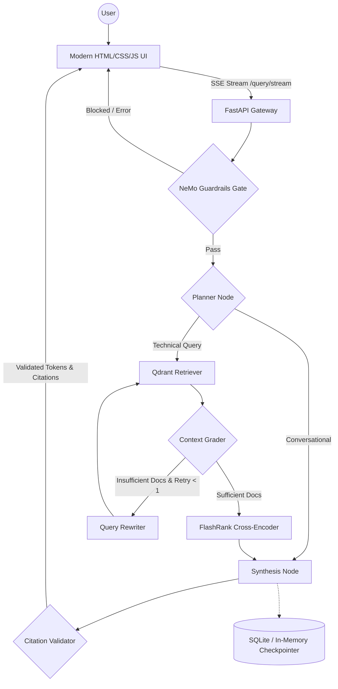

# Enterprise Agentic RAG (Scalable Pipeline)

A production-grade, enterprise-level RAG system built with **LangGraph**, **Portkey LLM Gateway**, **SentenceTransformers & Qdrant Cloud**, and a **Bespoke Minimalist HTML/CSS/JS Frontend**. The system distinguishes between technical "True Data" and random "Noisy Data" using semantic re-ranking, history-aware planning, bounded retrieval refinement, citation validation, and NeMo Guardrails for input/output safety.

## Key Features

- **Bespoke Minimalist Frontend**: Custom HTML/CSS/JS UI (served directly at `http://localhost:8000`) with smooth transitions, Agent OS sidebar, session memory ID, live thought process reasoning accordions, sources context drawer, and an instant **Stop Response** button.
- **Agentic Workflow**: LangGraph cyclic graph featuring:
  - Structured, validated **Planner** distinguishing greetings, memory, and technical inquiries.
  - **Retriever** with explicit typed outcomes (distinguishing no-match from vector DB outages, auth failures, or config mismatches).
  - **Context Grader & Query Rewriter**: Bounded retrieval refinement (max 1 retry) for queries with insufficient initial context.
  - **Deterministic Citation Validation**: Validates all generated `[N]` bracketed references against retrieved documents, sanitizing hallucinated references.
- **Next-Gen Models**: Primary reasoning powered by `openai/gpt-oss-120b` via Portkey Gateway; NeMo Guardrails and evaluation judging powered by `openai/gpt-oss-20b`.
- **Fail-Closed Guardrails**: NeMo Guardrails safety layer blocks off-topic, jailbreak, and prompt injections before retrieval under a deliberate fail-closed policy.
- **LLM Gateway**: Portkey routes all LLM calls with automatic retry, latency tracking, and fallback.
- **Enterprise Search**: Qdrant Cloud for vector search + FlashRank cross-encoder for local semantic reranking with observable degradation fallback.
- **Thread-Safe Embeddings**: Local `all-MiniLM-L6-v2` (384-dim, default) via `sentence-transformers` for zero rate limits, with validated optional Gemini embeddings support.
- **Office & PDF Ingestion**: Native PDF (`pypdf`), DOCX (`python-docx`), PPTX (`python-pptx`, with table parsing), HTML, and TXT parsing with comprehensive `IngestionReport`.
- **Observability**: Full trace nesting with **Pydantic Logfire** and **LangSmith** across every node.
- **Evaluation Suite**: RAGAS evaluation pipeline with isolated thread IDs, string context normalization, Jaccard tool correctness, and CLI runner.

---

## Agent Intelligence Flow



---

## Tech Stack

| Layer | Technology |
|-------|-----------|
| User Interface | Bespoke HTML5 / CSS3 / Vanilla JS (Minimalist Dark UI, SSE, AbortController) |
| Orchestration | LangChain + LangGraph (with bounded context refinement) |
| Primary LLM | `openai/gpt-oss-120b` (Groq via **Portkey** gateway) |
| Guardrails & Judge | `openai/gpt-oss-20b` (Groq / NeMo Guardrails) |
| Vector DB | Qdrant Cloud |
| Reranking | FlashRank (local TinyBERT cross-encoder with observable fallback) |
| Embeddings | Local `all-MiniLM-L6-v2` (384-dim, default) / Gemini (`gemini-embedding-2-preview`) |
| Citation Grounding | Deterministic citation extractor & validator (`validate_citations`) |
| Document Parsing | `pypdf`, `python-docx` (paragraphs + tables), `python-pptx` (tables), `beautifulsoup4` |
| Observability | Pydantic Logfire + LangSmith |
| Evaluation | RAGAS + Workflow Routing Correctness (Jaccard) |

---

## Getting Started

### 1. Install dependencies

```powershell
python -m venv .venv
.\.venv\Scripts\activate
pip install -r requirements.txt
```

### 2. Configure environment

Copy the sample environment file:
```powershell
copy .env.example .env
```

Ensure the required keys are populated in `.env`:
- `GROQ_API_KEY`
- `PORTKEY_API_KEY`
- `QDRANT_API_KEY` & `QDRANT_CLUSTER_ENDPOINT`

### 3. Run automated tests

Run the complete test suite (unit and integration tests with mocked external services):

```powershell
python -m unittest discover -s tests -p "test_*.py"
```

### 4. Run data ingestion

Parses all documents in `DATA/true_data`, chunks them, saves metadata to `processed_data/`, and indexes vectors into Qdrant. Generates a structured `IngestionReport`.

```powershell
python -m app.ingestion.processor DATA/true_data
```

> Note: To wipe and recreate the collection from scratch, explicitly pass `--wipe`. Never run with `--wipe` against production collections without confirmation.

### 5. Launch the application

Launch the unified FastAPI server:

```powershell
uvicorn app.main:app --reload --port 8000
```

Open your browser at:
👉 **`http://localhost:8000`**

- **Health check**: `GET /api/health`
- **Readiness check**: `GET /api/ready`
- **Streaming query**: `POST /query/stream`
- **Synchronous query**: `POST /query`
- **Clear memory**: `POST /memory/clear`

### 6. Run the evaluation suite

```powershell
python -m evals.run_evals --mode all
```

---

*Enterprise Agentic RAG System.*
