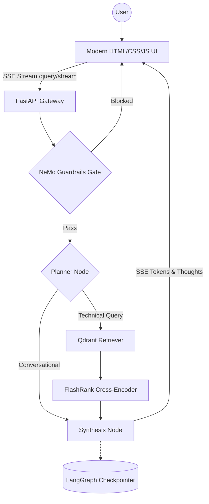

# Enterprise Agentic RAG (Scalable Pipeline)

A production-grade, enterprise-level RAG system built with **LangGraph**, **Portkey LLM Gateway**, **Local SentenceTransformers & Qdrant Cloud**, and a **Bespoke Minimalist HTML/CSS/JS Frontend**. The system distinguishes between technical "True Data" and random "Noisy Data" using semantic re-ranking, history-aware planning, and NeMo Guardrails for input/output safety.

## Key Features

- **Bespoke Minimalist Frontend**: Custom HTML/CSS/JS UI (served directly at `http://localhost:8000`) with smooth transitions, Agent OS sidebar, session memory ID, live thought process reasoning accordions, sources context drawer, and an instant **Stop Response** button.
- **Agentic Intelligence**: LangGraph for cyclic reasoning, multi-step planning, and conversational thread memory.
- **Next-Gen Models**: Primary reasoning powered by `openai/gpt-oss-120b` via Portkey Gateway; NeMo Guardrails and evaluation judging powered by `openai/gpt-oss-20b`.
- **Guardrails Gate**: NeMo Guardrails safety layer blocks off-topic, jailbreak, and injection inputs before retrieval.
- **LLM Gateway**: Portkey routes all LLM calls with automatic retry, latency tracking, and fallback.
- **Enterprise Search**: Qdrant Cloud for vector search + FlashRank cross-encoder for local semantic reranking.
- **Local Embeddings**: Local `all-MiniLM-L6-v2` (384-dim) embeddings via `sentence-transformers` for zero rate limits, with optional Gemini embeddings support.
- **Robust Local Document Parsing**: Native PDF (`pypdf`), DOCX (`python-docx`), PPTX (`python-pptx`), HTML, and TXT parsing without external OCR or Office dependencies.
- **Observability**: Full trace nesting with **Pydantic Logfire** and **LangSmith** across every node.
- **Evaluation Suite**: RAGAS-powered eval pipeline with dedicated evaluation app in `evals/app.py`.

---

## Agent Intelligence Flow



---

## Project Structure

```text
├── app/
│   ├── agents/
│   │   └── nodes/       # Planner, Retriever, Responder LangGraph nodes
│   ├── gateway/         # Portkey LLM gateway — routing, retries, and fallback
│   ├── guardrails/      # NeMo Guardrails input/output filtering (async & sync)
│   ├── ingestion/
│   │   ├── chunking/    # Paragraph-based text splitter (1500 char max)
│   │   └── loaders/     # Local parsers — PDF, HTML, TXT, DOCX, PPTX
│   ├── services/
│   │   └── retrieval/   # Local/Gemini embeddings + Qdrant search + FlashRank reranking
│   ├── static/          # Bespoke HTML/CSS/JS frontend
│   │   ├── css/style.css# Minimalist dark theme, animations, responsive design
│   │   ├── js/app.js    # SSE stream reader, AbortController stop button, markdown
│   │   └── index.html   # Single-page Agent OS UI
│   ├── config.py        # Centralized environment variable management
│   └── main.py          # FastAPI entrypoint — SSE streaming + memory reset + static UI
├── evals/               # RAGAS evaluation suite + CLI runner (run_evals.py)
├── processed_data/      # Parsed & chunked JSON metadata per document
├── docs/                # Architectural and operational guides (11 docs)
├── DATA/                # Documentation datasets (true_data vs noisy_data)
└── requirements.txt     # Pinned dependencies
```

---

## Tech Stack

| Layer | Technology |
|-------|-----------|
| User Interface | Bespoke HTML5 / CSS3 / Vanilla JS (Minimalist Dark UI, SSE, AbortController) |
| Orchestration | LangChain + LangGraph |
| Primary LLM | `openai/gpt-oss-120b` (Groq via **Portkey** gateway) |
| Guardrails & Judge | `openai/gpt-oss-20b` (Groq / NeMo Guardrails) |
| Vector DB | Qdrant Cloud |
| Reranking | FlashRank (local TinyBERT cross-encoder) |
| Embeddings | Local `all-MiniLM-L6-v2` (384-dim, default) / Gemini (`gemini-embedding-2-preview`) |
| Document Parsing | `pypdf`, `python-docx`, `python-pptx`, `beautifulsoup4` |
| Observability | Pydantic Logfire + LangSmith |
| Evaluation | RAGAS + custom Tool Correctness (Jaccard) |

---

## Getting Started

### 1. Install dependencies

```powershell
python -m venv venv
.\venv\Scripts\activate
pip install -r requirements.txt
```

### 2. Configure environment

Copy the sample environment file:
```powershell
copy .env.example .env
```

Fill in your API keys in `.env`:
```env
# Groq & Reasoning Models
GROQ_API_KEY = "gsk_..."
GROQ_MODEL = "openai/gpt-oss-120b"
GROQ_GUARD_MODEL = "openai/gpt-oss-20b"

# Portkey Gateway
PORTKEY_API_KEY = "pk-..."
PORTKEY_GROQ_SLUG = "rag"

# Embeddings (local SentenceTransformers avoids API rate limits)
EMBEDDING_PROVIDER = "local"
LOCAL_EMBEDDING_MODEL = "all-MiniLM-L6-v2"

# Qdrant Cloud Cluster
QDRANT_API_KEY = "..."
QDRANT_CLUSTER_ENDPOINT = "https://your-cluster-id.region.gcp.cloud.qdrant.io:6333"

# Observability
LOGFIRE_TOKEN = "..."
LANGSMITH_TRACING = true
LANGSMITH_ENDPOINT = "https://api.smith.langchain.com"
LANGSMITH_API_KEY = "..."
LANGSMITH_PROJECT = "rag_scale_test"

BACKEND_URL = "http://localhost:8000"
```

### 3. Run data ingestion

Parses all documents in `DATA/true_data`, chunks them, saves metadata to `processed_data/`, and indexes vectors into Qdrant.

```powershell
python -m app.ingestion.processor DATA/true_data --wipe
```

> Pass `--wipe` to drop and recreate the Qdrant collection.

### 4. Launch the application

Launch the unified FastAPI server:

```powershell
uvicorn app.main:app --reload --port 8000
```

Open your browser at:
👉 **`http://localhost:8000`**

### 5. Run the eval suite (optional)

```powershell
python -m evals.run_evals --mode all
```

---

*Built for High-Scale Enterprise Document Intelligence.*
